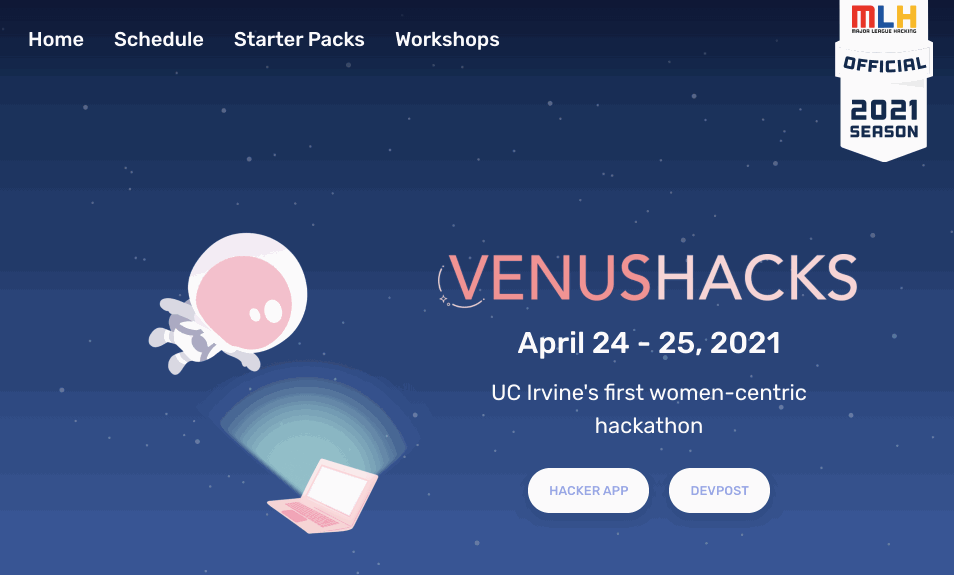

# VenusHacks Website
Planned in collaboration with [WICS](https://wics.ics.uci.edu/) and [Hack at UCI](https://hack.ics.uci.edu/), VenusHacks is UCI’s first women-centric hackathon!

## Mission
Our mission is to empower underrepresented groups by providing an inclusive community to foster growth and creativity in computing. 
VenusHacks will be open to participants of all experience levels, as we aim to increase diversity in tech through support, exposure, and community.

## Local Development

### Getting Setup
- `git clone https://github.com/WICS-UCI/venushacks.git`
- `cd venushacks`  
- `npm install`  

### Running the Project
- `npm start`  
- Open [http://localhost:3000](http://localhost:3000) to view it in the browser.

### Deploying
We use GitHub Pages to deploy our site. Make sure you are on the latest version of `master` before running the deploy command.
- `git checkout master`
- `git pull`
- `npm run deploy`
